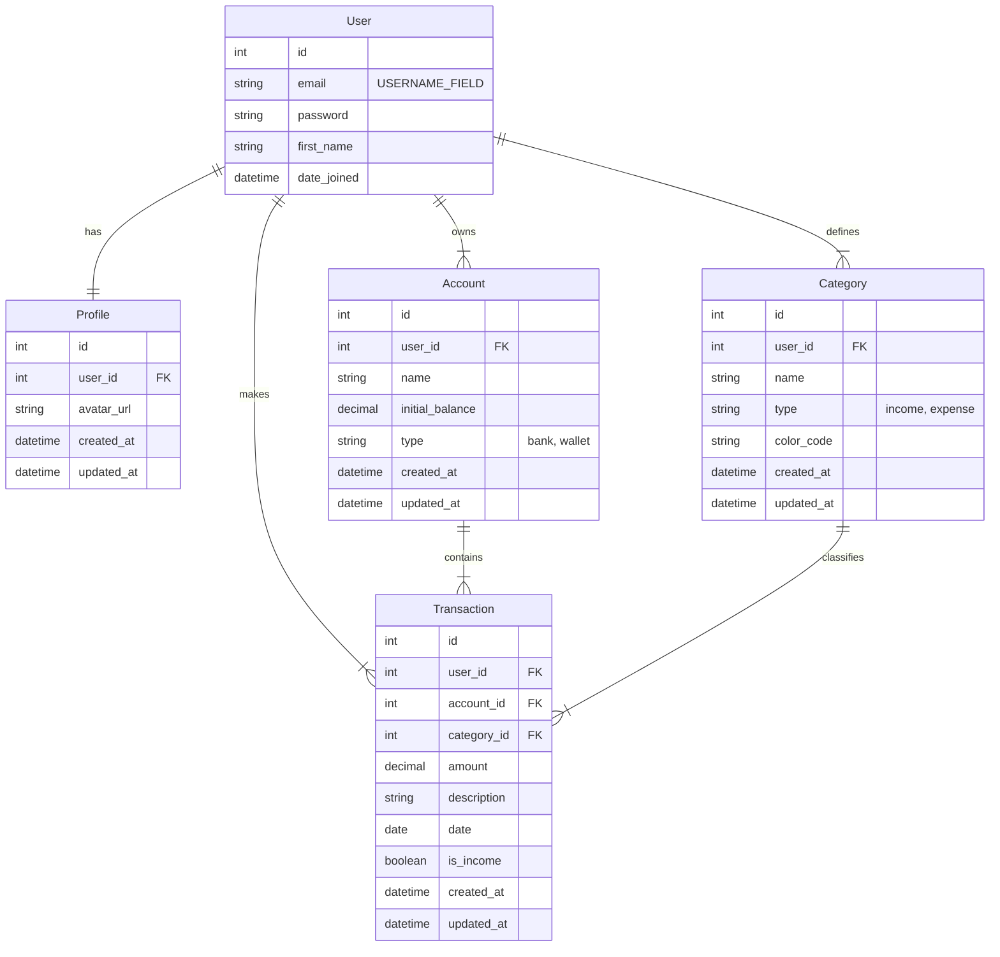

# Finanpy – Product Requirement Document (PRD)

---

## 1. Visão geral

**Finanpy** é um sistema web full-stack, desenvolvido em **Django** com frontend em **Django Template Language (DTL)** estilizado com **Tailwind CSS**, destinado à **gestão de finanças pessoais**. O sistema oferece uma interface moderna, responsiva e com fundo escuro, proporcionando uma experiência visual agradável e funcional para o usuário final. O projeto prioriza simplicidade, usabilidade e aderência às boas práticas do Django, evitando *over-engineering*.

---

## 2. Sobre o produto

Finanpy permite que usuários autenticados registrem, visualizem e categorizem suas **transações financeiras** (receitas e despesas), organizadas por **categorias personalizáveis**. O sistema oferece um **dashboard** com resumo financeiro, histórico de movimentações e métricas essenciais. A autenticação ocorre via **e-mail** (não username), e toda a interface é em **português brasileiro**, mesmo com código em inglês.

---

## 3. Propósito

Tornar a gestão financeira pessoal **acessível, intuitiva e visualmente agradável**, com baixa curva de aprendizado e foco na usabilidade diária, sem necessidade de integrações externas ou funcionalidades complexas.

---

## 4. Público alvo

- Pessoas físicas que desejam controlar gastos e receitas de forma simples.
- Usuários que preferem soluções autohospedáveis e leves.
- Desenvolvedores que buscam um exemplo de projeto Django bem estruturado e minimalista.

---

## 5. Objetivos

- ✅ Permitir cadastro e login por e-mail.
- ✅ Oferecer dashboard com resumo financeiro.
- ✅ Registrar transações com valor, tipo (entrada/saída), categoria e data.
- ✅ Permitir criação e edição de categorias.
- ✅ Exibir histórico de transações com filtros.
- ✅ Manter interface moderna e responsiva com tema escuro.
- ✅ Seguir arquitetura modular com apps separados por domínio.

---

## 6. Requisitos funcionais

### Fluxo de UX

O fluxo de experiência do usuário (UX) foi mapeado visualmente em um diagrama Mermaid que ilustra a jornada desde a página inicial pública até o dashboard, passando por cadastro, login, gestão de transações e categorias, e logout. O diagrama completo está disponível no repositório de design ou pode ser recriado com base nos critérios descritos nas user stories.

---

## 7. Requisitos não-funcionais

- **Performance**: carregamento rápido com SQLite e sem sobrecarga.
- **Segurança**: uso do sistema nativo de autenticação do Django.
- **Usabilidade**: interface clara, com feedback visual em ações.
- **Manutenibilidade**: código limpo, seguindo PEP8 e em inglês.
- **Responsividade**: layout adaptável a dispositivos móveis e desktops.
- **Internacionalização**: mensagens em português brasileiro apenas na UI.

---

## 8. Arquitetura técnica

### Stack

- **Backend**: Python 3.13+, Django 5+
- **Frontend**: Django Template Language + Tailwind CSS (via CDN ou build simples)
- **Banco de dados**: SQLite (padrão Django)
- **Autenticação**: Django Built-in (customizada para e-mail)
- **Deploy inicial**: Servidor de desenvolvimento do Django

### Estrutura de dados (Mermaid)

## 9. Design system

Baseado em **Tailwind CSS**, com tema escuro customizado.

### Paleta de cores

- **Fundo principal**: `bg-gray-900` (`#111827`)
- **Fundo de cards**: `bg-gray-800` (`#1f2937`)
- **Texto primário**: `text-gray-100` (`#f9fafb`)
- **Texto secundário**: `text-gray-400` (`#9ca3af`)
- **Borda**: `border-gray-700`
- **Cores de destaque**:
  - **Receita**: `text-emerald-400` / `bg-emerald-900/30`
  - **Despesa**: `text-rose-400` / `bg-rose-900/30`
- **Gradientes**:
  - Botões principais: `bg-gradient-to-r from-indigo-600 to-purple-600`
  - Cards: `bg-gradient-to-br from-gray-800 to-gray-900`

### Tipografia

- Fonte padrão: **Inter** (via Google Fonts, carregada no base template)
- Títulos: `font-bold text-xl` a `text-3xl`
- Parágrafos: `text-base`

### Componentes

- **Botões**:
  - Primário: `px-4 py-2 rounded-lg font-medium text-white bg-gradient-to-r from-indigo-600 to-purple-600 hover:opacity-90 transition`
  - Secundário: `px-4 py-2 rounded-lg font-medium text-gray-200 bg-gray-700 hover:bg-gray-600`
  - Destrutivo: `bg-rose-800 hover:bg-rose-700`

- **Inputs**:
  - `w-full px-3 py-2 bg-gray-800 border border-gray-700 rounded-lg text-gray-100 focus:outline-none focus:ring-2 focus:ring-indigo-500`

- **Forms**:
  - Contêiner: `max-w-2xl mx-auto p-6 bg-gray-800 rounded-xl shadow-lg`
  - Espaçamento: `space-y-4`

- **Grids**:
  - Dashboard: `grid grid-cols-1 md:grid-cols-2 lg:grid-cols-3 gap-6`
  - Tabelas: `w-full text-left border-collapse`
    - Cabeçalho: `text-gray-400 uppercase text-sm`
    - Linhas: `border-t border-gray-700 py-3`

- **Menu/Navbar**:
  - Fixo no topo (mobile: collapsible)
  - Fundo: `bg-gray-900/90 backdrop-blur`
  - Itens: `text-gray-300 hover:text-white`

---

## 10. User stories

### Épico: Autenticação e Onboarding

**Como** usuário novo,  
**quero** me cadastrar e fazer login com meu e-mail,  
**para** acessar meu dashboard financeiro.

#### Critérios de aceite:
- [ ] Formulário de cadastro com e-mail, senha (e confirmação)
- [ ] Validação de e-mail único
- [ ] Login com e-mail e senha
- [ ] Redirecionamento automático para `/dashboard` após login
- [ ] Mensagens de erro claras em português

---

### Épico: Gestão de Transações

**Como** usuário logado,  
**quero** registrar minhas receitas e despesas,  
**para** acompanhar meu fluxo de caixa.

#### Critérios de aceite:
- [ ] Formulário com: valor, data, tipo (entrada/saída), categoria
- [ ] Lista de transações com filtros (data, tipo, categoria)
- [ ] Valores exibidos com formatação monetária (R$)
- [ ] Receitas em verde, despesas em vermelho/rosa

---

### Épico: Gestão de Categorias

**Como** usuário,  
**quero** criar minhas próprias categorias,  
**para** organizar minhas finanças do meu jeito.

#### Critérios de aceite:
- [ ] Formulário para criar categoria com nome e tipo
- [ ] Listagem de categorias com opção de edição/exclusão
- [ ] Categorias separadas por tipo (receita/despesa)

---

### Épico: Dashboard Financeiro

**Como** usuário,  
**quero** visualizar um resumo financeiro na página inicial,  
**para** ter insights rápidos sobre minha situação.

#### Critérios de aceite:
- [ ] Saldo total atual
- [ ] Total de receitas e despesas no mês
- [ ] Últimas 5 transações
- [ ] Indicador visual de saldo positivo/negativo

---

## 11. Métricas de sucesso

### KPIs de produto
- Tempo médio de cadastro: < 60 segundos
- Taxa de conclusão de primeira transação: > 70%
- Taxa de retenção (retorno em 7 dias): > 40%

### KPIs de usuário
- Número médio de transações por usuário/semana
- Número de categorias criadas por usuário
- Tempo médio na dashboard por sessão

---

## 12. Riscos e mitigações

| Risco | Mitigação |
|------|----------|
| Usuário confuso com interface escura | Usar contraste adequado e testar com usuários reais |
| Login por e-mail quebrar o Django auth | Estender `AbstractUser` e sobrescrever `USERNAME_FIELD` |
| Tailwind não carregar em produção | Usar CDN ou configurar build simples com `django-tailwind` (opcional) |
| SQLite com muitos usuários simultâneos | Documentar que o sistema é para uso pessoal/local |

---

## 13. Lista de tarefas (por sprints)

### Sprint 0 – Setup e Autenticação

- [ ] **Configurar projeto Django**
  - [x] Criar projeto `finanpy`
  - [ ] Configurar `settings.py` com `accounts` como app de auth
  - [x] Adicionar apps: `accounts`, `profiles`, `categories`, `transactions`,`users`,
  - [ ] Configurar idioma: `LANGUAGE_CODE = 'pt-br'`
  - [ ] Configurar fuso horário: `TIME_ZONE = 'America/Sao_Paulo'`

- [ ] **Customizar modelo de usuário**
  - [ ] Criar `accounts/models.py` com `CustomUser(AbstractUser)`
  - [ ] Definir `USERNAME_FIELD = 'email'`
  - [ ] Tornar `email` único e obrigatório
  - [ ] Registrar no `admin.py`

- [ ] **Ativar migrações e criar superusuário**
  - [ ] `makemigrations` + `migrate`
  - [ ] Criar superuser via comando

- [ ] **Configurar login/logout com e-mail**
  - [ ] Sobrescrever `AuthenticationForm` para aceitar e-mail
  - [ ] Atualizar `LOGIN_REDIRECT_URL = '/dashboard/'`
  - [ ] Criar views de login/logout com `LoginView` e `LogoutView`

- [ ] **Templates base**
  - [ ] Criar `base.html` com Tailwind CDN
  - [ ] Incluir Google Fonts (Inter)
  - [ ] Definir bloco `content`
  - [ ] Aplicar fundo escuro global

- [ ] **Página pública inicial**
  - [ ] Criar `core/views.py` com `HomeView`
  - [ ] Template `home.html` com botões "Login" e "Cadastre-se"
  - [ ] Rota em `core/urls.py` → `/` → `HomeView`

- [ ] **Formulário de cadastro**
  - [ ] `accounts/forms.py` → `CustomUserCreationForm`
  - [ ] View `SignupView` (CBV)
  - [ ] Template com inputs estilizados
  - [ ] Redirecionar para `/dashboard` após signup

---

### Sprint 1 – Dashboard e Perfil

- [ ] **Criar app `profiles`**
  - [ ] Modelo `Profile` com FK para `User`
  - [ ] Campos `created_at`, `updated_at`
  - [ ] Signal para criar profile automaticamente

- [ ] **Dashboard view**
  - [ ] `main.py` ou `dashboard/views.py` → `DashboardView`
  - [ ] Contexto: saldo, transações recentes, totais mensais
  - [ ] Template `dashboard.html` com grid responsivo

- [ ] **Proteger rotas com `LoginRequiredMixin`**
  - [ ] Todas as views pós-login devem exigir autenticação

- [ ] **Navbar com dropdown de usuário**
  - [ ] Exibir nome/e-mail
  - [ ] Link para logout e perfil (futuro)

---

### Sprint 2 – Transações

- [ ] **Modelo `Transaction`**
  - [ ] Campos: `amount`, `date`, `type` (choices: income/expense), `category`, `user`
  - [ ] Campos `created_at`, `updated_at`
  - [ ] `__str__` e `Meta` ordenado por data

- [ ] **Formulário de transação**
  - [ ] `TransactionForm` com filtro de categorias por tipo e usuário
  - [ ] Validar valor > 0

- [ ] **Views de transações**
  - [ ] `TransactionCreateView`
  - [ ] `TransactionListView` com filtros (data range, tipo, categoria)
  - [ ] `TransactionUpdateView` e `DeleteView` (opcionais nesta sprint)

- [ ] **Template de lista de transações**
  - [ ] Tabela estilizada com Tailwind
  - [ ] Ícones de entrada/saída
  - [ ] Formatação de moeda (R$ 1.234,56)

---

### Sprint 3 – Categorias

- [ ] **Modelo `Category`**
  - [ ] Campos: `name`, `type` (income/expense), `user`
  - [ ] `created_at`, `updated_at`
  - [ ] Unique constraint: `(user, name, type)`

- [ ] **Views de categorias**
  - [ ] `CategoryCreateView`, `CategoryListView`, `CategoryUpdateView`, `CategoryDeleteView`

- [ ] **Integração com transações**
  - [ ] Ao criar transação, só exibir categorias do mesmo tipo
  - [ ] Ao excluir categoria, impedir se houver transações vinculadas

- [ ] **Template de gerenciamento de categorias**
  - [ ] Cards ou lista com botões de ação
  - [ ] Separar receitas e despesas visualmente

---

### Sprint 4 – Polimento e UX

- [ ] **Mensagens de sucesso/erro**
  - [ ] Usar `messages` do Django
  - [ ] Estilizar com Tailwind (verde para sucesso, vermelho para erro)

- [ ] **Formatação de moeda**
  - [ ] Criar template tag `currency` → `R$ 1.234,56`

- [ ] **Responsividade final**
  - [ ] Testar em mobile (iOS/Android)
  - [ ] Ajustar padding, fontes e grids

- [ ] **SEO básico**
  - [ ] Meta tags no `base.html`
  - [ ] Título dinâmico com ``

- [ ] **Documentação inicial**
  - [ ] Atualizar `README.md` com instruções de setup

---

### Futuras sprints (não implementar agora)

- [ ] Dockerização
- [ ] Testes unitários e de integração
- [ ] Exportação para CSV
- [ ] Gráficos com Chart.js
- [ ] Notificações (ex: limite de gastos)

--- 

✅ **Fim do PRD**. Pronto para início do desenvolvimento.