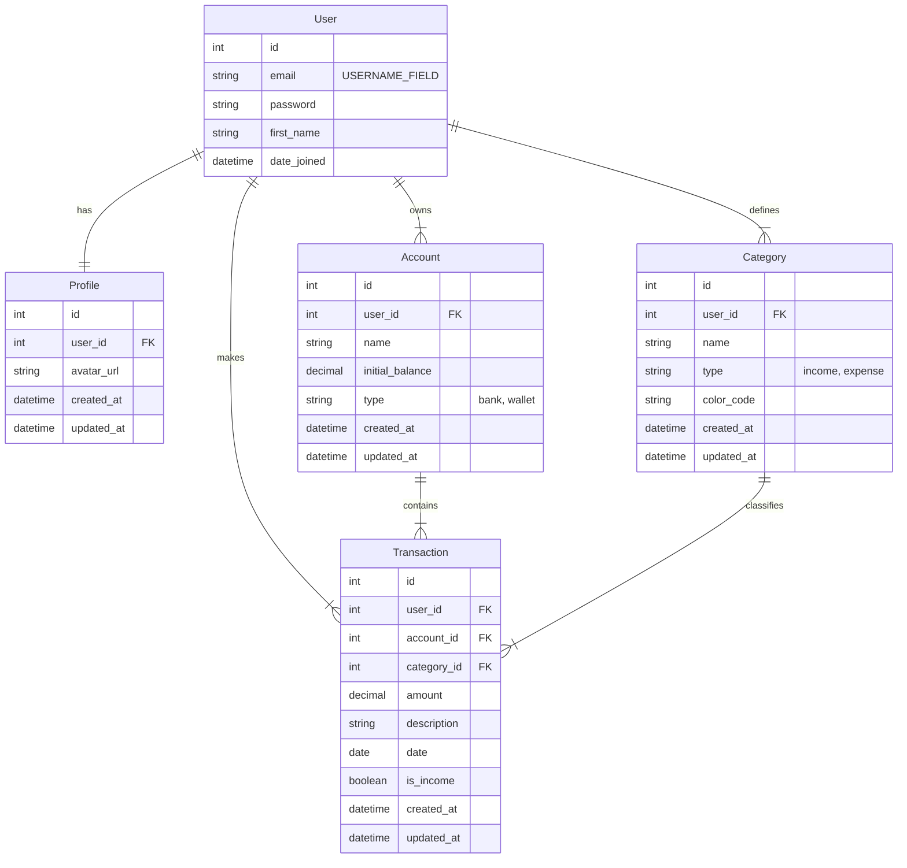

# Arquitetura Técnica

## Stack

- **Backend**: Python 3.13+, Django 5+
- **Frontend**: Django Template Language + Tailwind CSS (via CDN ou build simples)
- **Banco de dados**: SQLite (padrão Django)
- **Autenticação**: Django Built-in (customizada para e-mail)
- **Deploy inicial**: Servidor de desenvolvimento do Django

## Estrutura de Dados

## Apps do Projeto

O projeto é organizado em apps Django modulares:

- `accounts`: Gerenciamento de autenticação e usuários
- `profiles`: Informações complementares dos usuários
- `categories`: Categorização de transações
- `transactions`: Registro de movimentações financeiras
- `core`: Funcionalidades básicas e páginas públicas
- `users`: (referência ao modelo de usuário customizado)

## Requisitos não-funcionais

- **Performance**: carregamento rápido com SQLite e sem sobrecarga.
- **Segurança**: uso do sistema nativo de autenticação do Django.
- **Usabilidade**: interface clara, com feedback visual em ações.
- **Manutenibilidade**: código limpo, seguindo PEP8 e em inglês.
- **Responsividade**: layout adaptável a dispositivos móveis e desktops.
- **Internacionalização**: mensagens em português brasileiro apenas na UI.